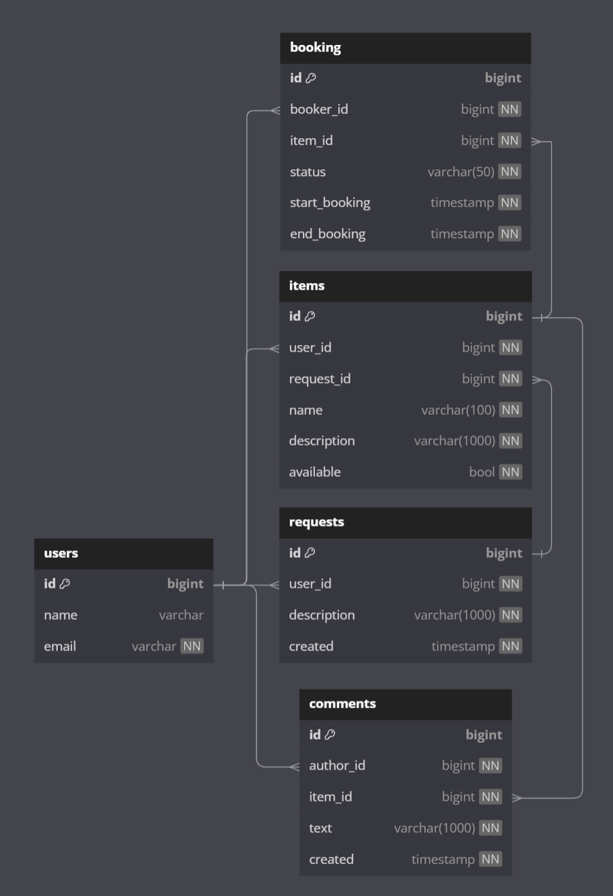

# java-shareit
Simple REST application, written on Java using Spring Boot.  
The service allows users to report what things they are willing to share, as well as find the desired thing and rent it for a certain period. You can reserve a thing for certain dates. Access to it from other users is closed during the booking period. If the desired thing is not on the service, users have the opportunity to leave requests. Upon request, it will be possible to add new things for exchange.

## Database structure


## Endpoints
1. ***Users***   
   `POST /users` Create user  
   Example request body:
   ```json
   {
      "name": "user",
      "email": "user@user.com"
   }
   ```
   `GET /users/{id}` Get user by `id`  
   `GET /users` Get list of all users  
   `PATCH /users/{id}` Change user info  
   ```json
   {
      "name": "user",
      "email": "user@user.com"
   }
   ```
   `DELETE /users/{id}` Delete user by `id`
2. ***Requests***  
   UserId passed in request header `X-Sharer-User-Id`.  
   `POST /requests` Create request
   ```json
   {
   "description": "description"
   }
   ```
   `GET /requests/{requestId}` Get request by `id`  
   `GET /requests` Get list of all requests from current user  
   `GET /requests/all` Get list of all requests from other users
3. ***Items***  
   UserId passed in request header `X-Sharer-User-Id`.  
   `POST /items` Create item  
   ```json
   {
   "name": "item name",
   "description": "item description",
   "available": true,
   "requestId": 1
   }
   ```
   `GET /items/{id}` Get item by `id`  
   `GET /items` Get list of all items from current user  
   `PATCH /items/{id}` Change item info  
   ```json
   {
   "id": 1,
   "name": "new item name",
   "description": "new item description",
   "available": false
   }
   ```
   `DELETE /items/{id}` Delete item by `id`
   `GET /items/search?text={text}` Search item by name or description
   `POST /items/{itemId}/comment` Add comment to the item
   ```json
   {
   "text": "Comment for item 1"
   }
   ```
4. ***Bookings***  
   UserId passed in request header `X-Sharer-User-Id`.  
   `POST /bookings` Create booking  
   ```json
   {
   "itemId": 2,
   "start": "2024-09-25T13:20:57",
   "end": "2024-09-26T13:20:57"
   }
   ```
   `PATCH /bookings/{bookingId}?approved={approved}` Approve or decline booking status by owner of item. `approved` may be `true` or `false`  
   `GET /bookings/{bookingId}` Get booking by `id`  
   `GET /bookings?state={state}` Get list of all booking for user. `state` may be `ALL`, `CURRENT`, `PAST`, `FUTURE`, `WAITING`, `REJECTED`   
   `GET /bookings/owner?state={state}` Get list of all booking for owner. `state` may be `ALL`, `CURRENT`, `PAST`, `FUTURE`, `WAITING`, `REJECTED`